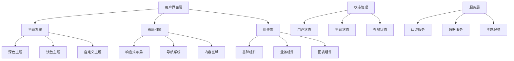

# Design Document: Admin UI Enhancement

## Overview

本设计文档详细描述了二手商城后台管理系统的UI增强方案，旨在将现有的基础管理界面升级为现代化、高端大气的专业管理平台。设计采用渐进式改进策略，在保持现有功能完整性的基础上，全面提升视觉效果、用户体验和操作便利性。

## Architecture

### 系统架构概览



### 技术栈选择

- **前端框架**: UmiJS 4.x + React 18
- **UI组件库**: Ant Design 5.x (支持CSS-in-JS和主题定制)
- **布局系统**: ProLayout (Ant Design Pro)
- **图表库**: ECharts 5.x (专业数据可视化)
- **样式方案**: Less + CSS Variables (支持动态主题切换)
- **状态管理**: UmiJS内置Model (轻量级状态管理)
- **动画库**: Framer Motion (流畅的UI动画)

## Components and Interfaces

### 1. 主题系统 (Theme System)

#### 主题配置接口
```typescript
interface ThemeConfig {
  mode: 'light' | 'dark' | 'auto';
  primaryColor: string;
  borderRadius: number;
  colorScheme: {
    primary: string;
    secondary: string;
    success: string;
    warning: string;
    error: string;
    info: string;
  };
  layout: {
    headerHeight: number;
    siderWidth: number;
    contentPadding: number;
  };
}
```

#### 主题服务
```typescript
interface ThemeService {
  getCurrentTheme(): ThemeConfig;
  setTheme(theme: Partial<ThemeConfig>): void;
  toggleMode(): void;
  resetToDefault(): void;
  saveUserPreference(): void;
}
```

### 2. 布局引擎 (Layout Engine)

#### 布局配置接口
```typescript
interface LayoutConfig {
  layout: 'side' | 'top' | 'mix';
  fixedHeader: boolean;
  fixedSider: boolean;
  splitMenus: boolean;
  contentWidth: 'Fluid' | 'Fixed';
  colorWeak: boolean;
}
```

#### 响应式断点
```typescript
interface BreakpointConfig {
  xs: number; // < 576px
  sm: number; // >= 576px
  md: number; // >= 768px
  lg: number; // >= 992px
  xl: number; // >= 1200px
  xxl: number; // >= 1600px
}
```

### 3. 导航系统 (Navigation System)

#### 菜单项接口
```typescript
interface MenuItem {
  key: string;
  label: string;
  icon?: React.ReactNode;
  path?: string;
  children?: MenuItem[];
  badge?: number | string;
  disabled?: boolean;
  hidden?: boolean;
}
```

#### 面包屑接口
```typescript
interface BreadcrumbItem {
  title: string;
  path?: string;
  icon?: React.ReactNode;
}
```

### 4. 用户认证组件 (User Authentication)

#### 用户信息接口
```typescript
interface UserInfo {
  id: string;
  username: string;
  realName?: string;
  avatar?: string;
  role: string;
  permissions: string[];
  lastLoginTime?: Date;
}
```

#### 用户操作菜单
```typescript
interface UserMenuAction {
  key: string;
  label: string;
  icon: React.ReactNode;
  danger?: boolean;
  onClick: () => void | Promise<void>;
}
```

### 5. 数据可视化组件

#### 统计卡片接口
```typescript
interface StatisticCardProps {
  title: string;
  value: number | string;
  prefix?: React.ReactNode;
  suffix?: React.ReactNode;
  trend?: {
    value: number;
    type: 'up' | 'down';
  };
  loading?: boolean;
  color?: string;
  formatter?: (value: any) => string;
}
```

#### 图表配置接口
```typescript
interface ChartConfig {
  type: 'line' | 'bar' | 'pie' | 'area';
  data: any[];
  options: {
    responsive: boolean;
    animation: boolean;
    theme: 'light' | 'dark';
    colors: string[];
  };
}
```

## Data Models

### 1. 主题数据模型

```typescript
// 主题状态模型
interface ThemeState {
  current: ThemeConfig;
  available: ThemeConfig[];
  loading: boolean;
  error?: string;
}

// 主题变量映射
interface ThemeVariables {
  '--primary-color': string;
  '--success-color': string;
  '--warning-color': string;
  '--error-color': string;
  '--text-color': string;
  '--bg-color': string;
  '--border-color': string;
  '--shadow-color': string;
}
```

### 2. 布局数据模型

```typescript
// 布局状态模型
interface LayoutState {
  config: LayoutConfig;
  collapsed: boolean;
  mobile: boolean;
  breadcrumbs: BreadcrumbItem[];
  activeMenuKeys: string[];
}

// 响应式状态
interface ResponsiveState {
  breakpoint: keyof BreakpointConfig;
  screenWidth: number;
  screenHeight: number;
  isMobile: boolean;
  isTablet: boolean;
}
```

### 3. 用户会话模型

```typescript
// 用户会话状态
interface UserSession {
  user: UserInfo | null;
  token: string | null;
  refreshToken: string | null;
  isAuthenticated: boolean;
  permissions: Set<string>;
  preferences: UserPreferences;
}

// 用户偏好设置
interface UserPreferences {
  theme: string;
  language: string;
  layout: LayoutConfig;
  notifications: boolean;
  autoSave: boolean;
}
```

## Correctness Properties

*A property is a characteristic or behavior that should hold true across all valid executions of a system-essentially, a formal statement about what the system should do. Properties serve as the bridge between human-readable specifications and machine-verifiable correctness guarantees.*

### Property 1: Theme System Consistency
*For any* theme configuration change, all UI components should consistently apply the new theme colors, typography, and spacing rules without visual inconsistencies.
**Validates: Requirements 1.1, 1.2, 1.3, 1.5**

### Property 2: Interactive Element Feedback
*For any* interactive element (buttons, cards, menu items), hovering or clicking should trigger appropriate visual feedback animations within the expected timeframe.
**Validates: Requirements 1.4, 5.2**

### Property 3: Responsive Layout Adaptation
*For any* screen size change, the layout engine should adapt all components to maintain usability and visual hierarchy across different device breakpoints.
**Validates: Requirements 2.4, 6.1, 6.2, 6.3**

### Property 4: Navigation State Consistency
*For any* navigation action, the active menu items should be properly highlighted and breadcrumb navigation should accurately reflect the current page location.
**Validates: Requirements 2.2, 2.3**

### Property 5: Dashboard Widget Functionality
*For any* dashboard widget operation (drag, resize, filter), the widget should maintain its functionality and data integrity while providing smooth user interactions.
**Validates: Requirements 2.5, 3.3**

### Property 6: Data Visualization Quality
*For any* chart or statistics display, the system should use consistent professional color schemes, smooth animations, and proper data formatting.
**Validates: Requirements 3.1, 3.2**

### Property 7: Table Operations Consistency
*For any* table interaction (sorting, filtering, pagination), the table should maintain data integrity and provide immediate visual feedback for user actions.
**Validates: Requirements 3.4**

### Property 8: Export Functionality Reliability
*For any* data export operation, the system should provide progress indicators and successfully generate downloadable files with correct data formatting.
**Validates: Requirements 3.5**

### Property 9: User Authentication Flow
*For any* user authentication action (login, logout, session management), the system should properly manage authentication state and provide appropriate user feedback.
**Validates: Requirements 4.1, 4.2, 4.3, 4.4, 4.5**

### Property 10: Loading State Management
*For any* asynchronous operation, the system should display appropriate loading indicators (animations, skeleton screens) and handle loading states consistently.
**Validates: Requirements 5.1, 7.2**

### Property 11: Keyboard Accessibility
*For any* keyboard navigation action, the system should provide proper focus management and keyboard shortcuts for common operations.
**Validates: Requirements 5.3, 8.1**

### Property 12: Error Handling Consistency
*For any* error condition, the system should display user-friendly error messages with recovery suggestions and maintain system stability.
**Validates: Requirements 5.4**

### Property 13: Auto-save Functionality
*For any* form data input, the system should automatically save user input at regular intervals to prevent data loss.
**Validates: Requirements 5.5**

### Property 14: Touch Interface Optimization
*For any* touch device interaction, the system should provide appropriately sized touch targets and touch-friendly interaction patterns.
**Validates: Requirements 6.4, 6.5**

### Property 15: Performance Optimization
*For any* component loading or navigation action, the system should implement lazy loading and code splitting to maintain optimal performance.
**Validates: Requirements 7.1, 7.5**

### Property 16: Data Caching Efficiency
*For any* frequently accessed data, the system should implement proper caching mechanisms to reduce loading times and improve user experience.
**Validates: Requirements 7.3**

### Property 17: Navigation Transitions
*For any* page navigation, the system should provide smooth transitions and maintain visual continuity between different sections.
**Validates: Requirements 7.4**

### Property 18: Accessibility Compliance
*For any* UI element, the system should provide proper ARIA labels, screen reader support, and high contrast mode compatibility.
**Validates: Requirements 8.1, 8.2, 8.3**

### Property 19: Internationalization Support
*For any* language change, the system should update all interface text while maintaining consistent layout and functionality.
**Validates: Requirements 8.4, 8.5**

## Error Handling

### 1. 主题系统错误处理

- **主题加载失败**: 回退到默认主题，显示用户友好的错误提示
- **主题配置无效**: 验证配置参数，提供配置修复建议
- **主题切换失败**: 保持当前主题，记录错误日志并通知用户

### 2. 布局系统错误处理

- **响应式断点异常**: 使用安全的默认断点值，确保布局不崩溃
- **导航状态异常**: 重置导航状态到安全的默认值
- **组件渲染失败**: 显示错误边界组件，提供重试选项

### 3. 用户认证错误处理

- **Token过期**: 自动刷新Token或引导用户重新登录
- **权限不足**: 显示权限不足页面，提供联系管理员选项
- **网络连接失败**: 显示离线状态，提供重试机制

### 4. 数据加载错误处理

- **API请求失败**: 显示错误信息和重试按钮
- **数据格式错误**: 记录错误并显示默认数据或空状态
- **超时处理**: 显示超时提示，提供取消和重试选项

## Testing Strategy

### 双重测试方法

本项目采用单元测试和属性测试相结合的综合测试策略：

- **单元测试**: 验证具体示例、边缘情况和错误条件
- **属性测试**: 验证所有输入下的通用属性
- **集成测试**: 验证组件间的交互和数据流
- **端到端测试**: 验证完整的用户工作流程

### 测试框架配置

- **单元测试框架**: Jest + React Testing Library
- **属性测试框架**: fast-check (JavaScript属性测试库)
- **端到端测试**: Playwright
- **视觉回归测试**: Chromatic + Storybook

### 属性测试配置

每个属性测试将运行最少100次迭代，使用以下标签格式：
**Feature: admin-ui-enhancement, Property {number}: {property_text}**

### 测试覆盖率要求

- 代码覆盖率: ≥ 90%
- 分支覆盖率: ≥ 85%
- 函数覆盖率: ≥ 95%
- 行覆盖率: ≥ 90%

### 性能测试

- **加载性能**: 首屏加载时间 < 2秒
- **交互性能**: 用户操作响应时间 < 100ms
- **内存使用**: 内存泄漏检测和优化
- **包大小**: 主包大小 < 500KB，懒加载包 < 200KB